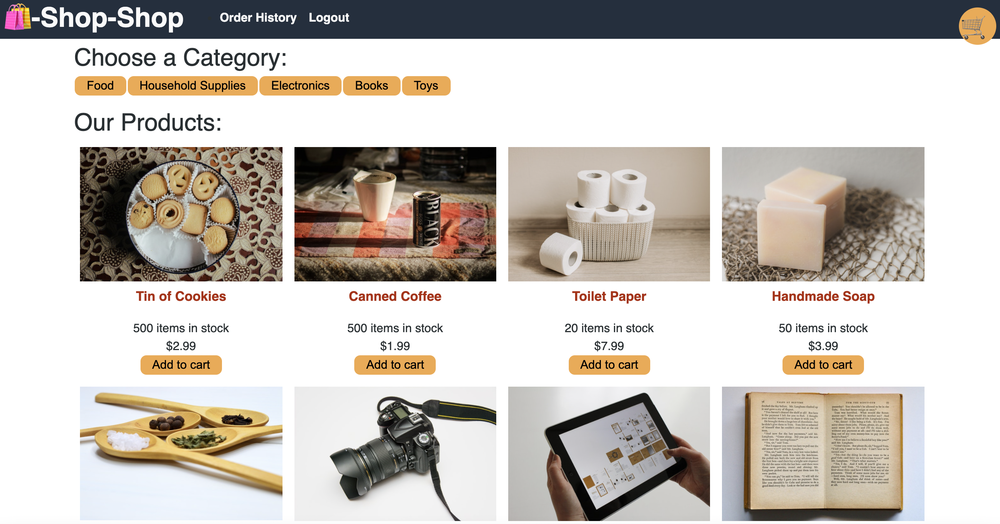

# shop-shop

## Description
An e-commerce application called Shop-Shop, with offline capabilities using IndexedDB as well as the ability to handle secure online payments with a service called Stripe.

  ## Table of Contents
* [License](#license)
* [Mock-up](#mockup)
* [Questions](#questions)

## License

## Mockup

## Questions
If you have any questions about this project, send me an email at lizethariasc14@gmail.com or contact me through my [GitHub](https://github.com/lizariasc).